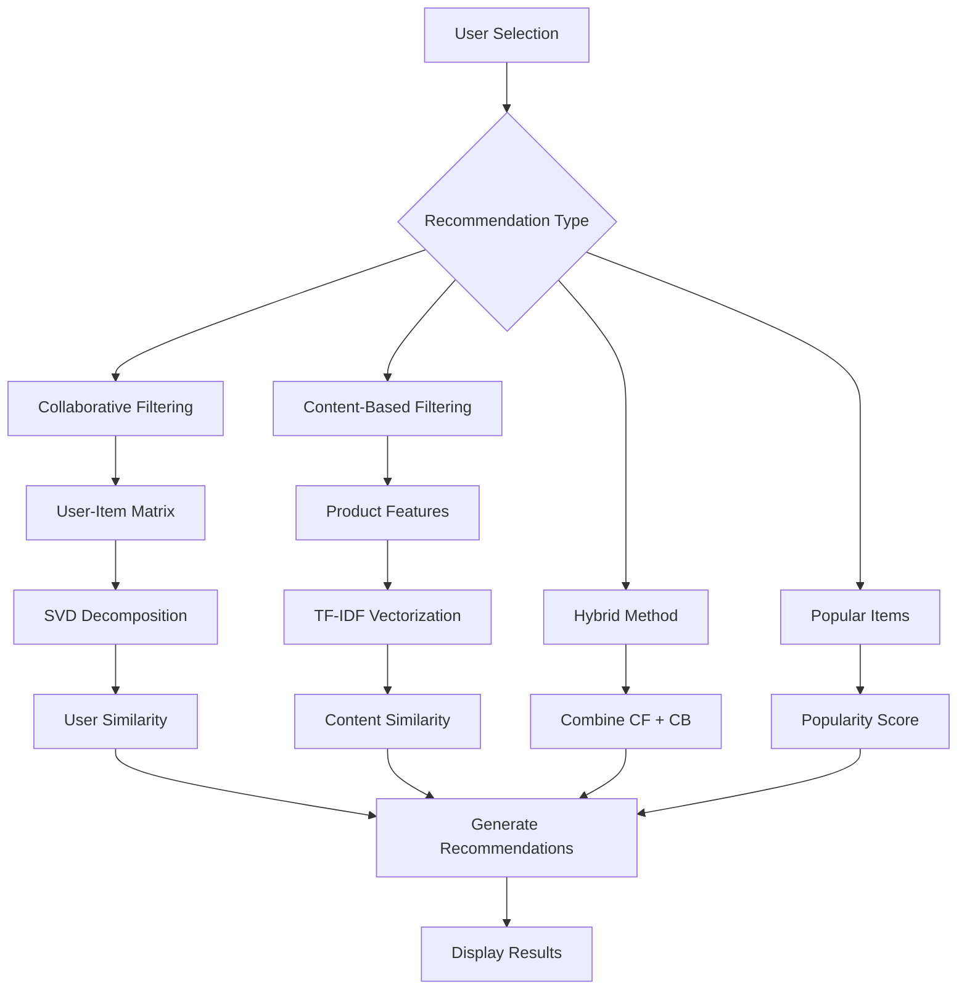

# Pickyfy - AI Product Recommender System

**Pickyfy** is an AI-based product recommendation system that uses machine learning techniques to provide personalized and accurate product recommendations, similar to those used by major e-commerce platforms such as Tokopedia, Shopee, and Amazon.

## Features

### AI Recommendation Algorithms
- **Collaborative Filtering**: Recommendations based on similar user behavior
- **Content-Based Filtering**: Recommendations based on product characteristics
- **Hybrid Approach**: Combination of both methods for optimal results
- **Popular Items**: Fallback for new users

### Analytics Dashboard
- **User Behavior Analysis**: Analyze buying patterns and preferences
- **Product Analysis**: Product category distribution and pricing
- **Transaction Trends**: Daily transaction trends and ratings

### Interactive UI
- **Real-time Recommendations**: Generate real-time recommendations
- **Customizable Parameters**: Set the number and method of recommendations
- **Visual Analytics**: Interactive dashboard with graphs and charts
- Responsive Design**: Clean and user-friendly UI

## Quick Start

### Prerequisites
- Python 3.8 or later
- Git

### Installation

1. **Clone repository**
   ```bash
   git clone https://github.com/Aqilrmm/Pickyfy.git
   cd Pickyfy
   ```

2. **Create virtual environment** (recommended)
   ```bash
   python -m venv venv
   
   # Windows
   venv\Scripts\activate
   
   # Mac/Linux
   source venv/bin/activate
   ```

3. **Install dependencies**
   ```bash
   pip install -r requirements.txt
   ```

4. **Run the application**
   ```bash
   streamlit run app.py
   ```

5. **Open browser**
   - The app should open automatically at `http://localhost:8501`
   - If not, open a browser and access the URL

## How to Use

### 1. **Select User**
- Select User ID from the dropdown in the sidebar
- Each user has a different purchase history

### 2. **Choose Recommendation Method**
- **Hybrid**: Combination of collaborative and content-based (recommended)
- **Collaborative Filtering**: Based on users with similar preferences
- **Content-Based**: Based on characteristics of products that have been purchased
- **Popular Items**: Popular products in general

### 3. **Set Parameters**
- Set the number of recommendations (1-10)
- Click “Generate Recommendations” to get the result

### 4. **Explore Analytics**
- **User Behavior**: View purchase history and category preferences
- **Product Analysis**: Analyze product distribution and pricing
- **Transaction Trends**: Transaction trends and ratings

## Technical Architecture


### Data Structure


### Algorithm Flow


## Performance Metrics

### Algorithm Comparison
| Method | Precision | Recall | Coverage | Novelty |
|--------|-----------|--------|----------|---------|
| Collaborative Filtering | High | Medium | Medium | High |
| Content-Based | Medium | High | High | Low |
| Hybrid | High | High | High | Medium |
| Popular Items | Low | Low | Low | Very Low |

### System Performance
- **Response Time**: < 2 seconds to generate recommendations
- **Memory Usage**: ~50MB for sample dataset
- **Scalability**: Can handle up to 10,000 products and 1,000 users

## Customization

### Adding New Data
```python
# Extend product catalog
new_products = pd.DataFrame({
    'product_id': ['P101', 'P102'],
    'name': ['New Product 1', 'New Product 2'],
    'category': ['Electronics', 'Clothing'],
    # ... other columns
})

# Append to existing data
recommender.products_df = pd.concat([recommender.products_df, new_products])
recommender.prepare_data()  # Re-process features
```

### Custom Recommendation Logic
```python
def custom_recommendation_method(self, user_id, n_recommendations=5):
    # Your custom algorithm here
    # Return list of product_ids
    return recommended_products
```

### UI Customization
- Modify CSS styles in `app.py`
- Add custom components in Streamlit
- Integration with external databases

### Sample Data

This project uses a sample dataset that includes:
- **6 product categories**: Electronics, Apparel, Books, Home & Garden, Sports, Beauty
- **8 brands**: Samsung, Apple, Nike, Adidas, Zara, H&M, Canon, Sony
- **5 user locations**: Jakarta, Surabaya, Bandung, Medan, Semarang
- **Rating scale**: 1-5 stars
- **Price range**: $10 - $1000

### Future Upgrades

### Planned Features
- [ ] **Deep Learning Model**: Neural collaborative filtering
- [ ] **Real-Time Learning**: Online learning algorithm
- [ ] **A/B Testing**: Framework for testing algorithm performance
- [ ] **API Integration**: REST API for external applications
- [ ] **Database Integration**: PostgreSQL/MongoDB support
- [ ] **Advanced Analysis**: Cohort analysis, RFM segmentation
- [ ] **Mobile Apps**: React Native mobile app

### Technical Enhancements
- **Caching**: Redis integration for faster response
- **Batch Processing**: Airflow for scheduled model updates
- **Model Monitoring**: MLflow for experiment tracking
- **Load Testing**: Performance testing with Locust
- **Docker Support**: Containerization for easy deployment

## Contributing

We welcome contributions from the community! Here's how to contribute:

### Development Setup
1. Fork repository
2. Create feature branch: `git checkout -b feature/amazing-feature`
3. Make changes dan test thoroughly
4. Commit changes: `git commit -m 'Add amazing feature'`
5. Push to branch: `git push origin feature/amazing-feature`
6. Submit Pull Request

### Contribution Guidelines
- Follow PEP 8 coding standards
- Add tests untuk new features
- Update documentation sesuai changes
- Ensure all tests pass sebelum submit PR

### Bug Reports
Use GitHub Issues to report bugs with templates:
- **Description**: Clear description of the bug
- **Steps to Reproduce**: Step-by-step instructions
- **Expected Behavior**: What should happen
- **Actual Behavior**: What actually happens
- **Environment**: OS, Python version, dll

## License

This project uses the MIT License. See the [LICENSE](LICENSE) file for full details.

## Team

- **Developer**: [Aqil](https://github.com/Aqilrmm)
- **Project Type**: Educational/Portfolio Project
- **Status**: Active Development

## Support

Need help?

- 📧 **Email**: [aqilr834@gmail.com]
- 💬 **GitHub Issues**: [Create new issue](https://github.com/Aqilrmm/Pickyfy/issues)

## Acknowledgments

Thanks for :
- **Streamlit** untuk amazing web app framework
- **Scikit-learn** untuk comprehensive ML tools
- **Plotly** untuk interactive visualizations
- **Pandas & NumPy** untuk powerful data manipulation

---

**Star this repository** jika project ini helpful untuk Anda!

**Share** dengan teman-teman yang tertarik dengan recommendation systems!

---

<div align=“center”>

**Made with ❤️ for the Data Science Community**

[🏠 Home](https://github.com/Aqilrmm/Pickyfy) | [🐛 Issues](https://github.com/Aqilrmm/Pickyfy/issues)

</div>